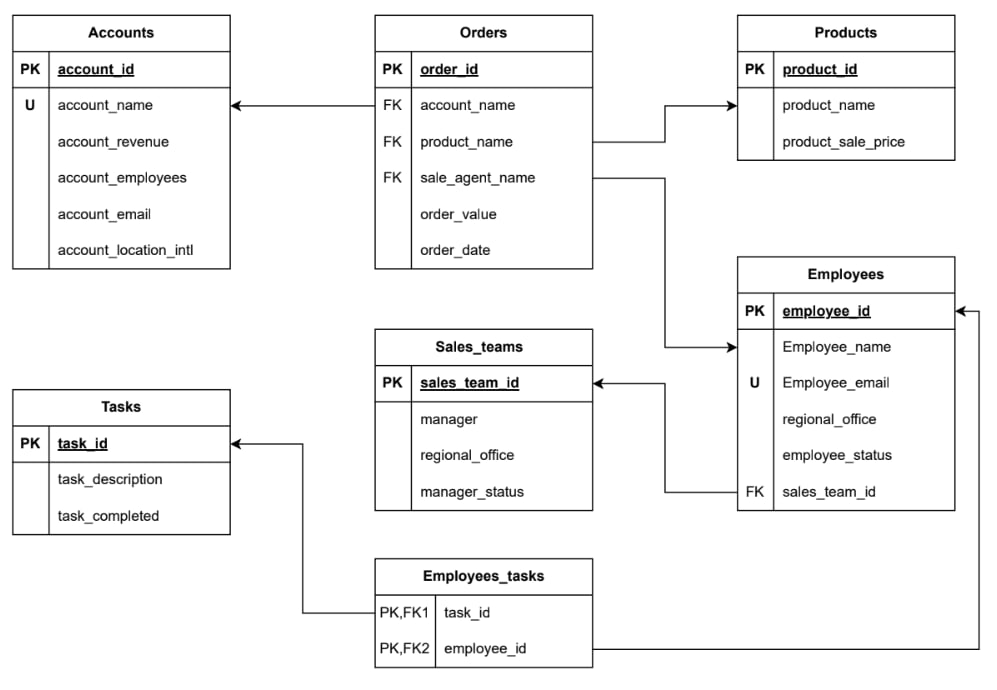

# MKT_CRM_DB


## Package install

`sudo apt install python3.12-venv`

## Set up enviremonet

`python3 -m venv ~/myenv`
`source ~/myenv/bin/activate`

## Libary install

`pip3 install mysql-connector-python`

## Enable and start MySQL

`sudo systemctl enable mysql.service`
`sudo systemctl start mysql.service`

## Create sql user
```SQL
CREATE USER 'popcorn'@'localhost' IDENTIFIED BY 'popcorn';
GRANT ALL PRIVILEGES ON mkt_final.* TO 'popcorn'@'localhost';
FLUSH PRIVILEGES;
```

## Source
`github.com/adityashah0112/DBMS-CRM-demo/blob/main/orders.csv`
